# BlenderMCP：BlenderとClaude AIを連携させるModel Context Protocolの詳細解析

## はじめに

BlenderMCPは、Model Context Protocol (MCP) を通じてBlenderをClaude AIに接続し、自然言語プロンプトによる3Dモデリング、シーン作成、操作を可能にする革新的なプロジェクトです。

このプロジェクトにより、ユーザーはClaude AIに対して「赤い立方体を作成して」や「ダンジョンの中に金の壺を守るドラゴンがいるシーンを作成して」といった自然言語の指示を出すだけで、Blenderで3Dコンテンツを生成・操作できるようになります。

本記事では、BlenderMCPの内部実装を詳細に解析し、その仕組みと技術的な側面を深掘りします。

## アーキテクチャ概要

BlenderMCPは主に2つの主要コンポーネントで構成されています：

1. **Blenderアドオン (`addon.py`)**: Blender内にソケットサーバーを作成し、コマンドを受信して実行するコンポーネント
2. **MCPサーバー (`server.py`)**: Model Context Protocolを実装し、Blenderアドオンに接続するPythonサーバー

### コンポーネント図

以下の図は、BlenderMCPの主要コンポーネントとその関係を示しています：

```mermaid
graph LR
    %% ノードのスタイル定義
    classDef user fill:#f9d5e5,stroke:#eeac99,color:#333,font-weight:bold
    classDef ai fill:#d3f8e2,stroke:#77c9d4,color:#333,font-weight:bold
    classDef server fill:#e3f6f5,stroke:#bae8e8,color:#333,font-weight:bold
    classDef addon fill:#ffd8be,stroke:#f8a978,color:#333,font-weight:bold
    classDef external fill:#f0e6ef,stroke:#c8b8db,color:#333,font-weight:bold

    User[ユーザー] -->|指示| Claude[Claude AI]
    Claude -->|MCP| Server[MCPサーバー\nserver.py]
    Server -->|ソケット通信| Addon[Blenderアドオン\naddon.py]
    Addon -->|bpy API| Blender[Blender]
    Addon -->|API呼び出し| PolyHaven[Poly Haven API]
    Addon -->|API呼び出し| Hyper3D[Hyper3D Rodin API]
    Blender -->|レンダリング結果| User

    %% クラスの適用
    class User user
    class Claude ai
    class Server server
    class Addon addon
    class Blender external
    class PolyHaven external
    class Hyper3D external
```



これらのコンポーネントは以下のように連携して動作します：

1. ユーザーがClaude AIに指示を出す
2. Claude AIがMCPサーバーを通じてBlenderアドオンにコマンドを送信
3. Blenderアドオンがコマンドを実行し、結果をMCPサーバーに返す
4. MCPサーバーが結果をClaude AIに返し、Claude AIがユーザーに結果を表示

### クラス図

以下の図は、BlenderMCPの主要クラスとその関係を示しています：

```mermaid
classDiagram
    class BlenderMCPServer {
        +host: string
        +port: int
        +running: bool
        +socket: Socket
        +client: Socket
        +buffer: bytes
        +start()
        +stop()
        +_process_server()
        +execute_command(command)
        +_execute_command_internal(command)
        +get_scene_info()
        +create_object(type, name, location, rotation, scale)
        +modify_object(name, location, rotation, scale)
        +delete_object(name)
        +set_material(object_name, material_name, color)
    }
    
    class BlenderConnection {
        +host: string
        +port: int
        +sock: Socket
        +connect()
        +disconnect()
        +receive_full_response(sock, buffer_size)
        +send_command(command_type, params)
    }
    
    class FastMCP {
        +name: string
        +description: string
        +lifespan: function
        +tool(func)
        +prompt(func)
        +run()
    }
    
    BlenderConnection --> FastMCP : 使用される
    FastMCP --> BlenderConnection : コマンド送信
    BlenderConnection --> BlenderMCPServer : 接続・コマンド送信
    BlenderMCPServer --> BlenderConnection : レスポンス返却
```



## 通信プロトコル

BlenderMCPはTCPソケットを介したシンプルなJSONベースのプロトコルを使用しています。

### シーケンス図

以下の図は、コマンド実行の流れを示しています：

```mermaid
sequenceDiagram
    %% 参加者のスタイル定義
    participant User as ユーザー
    participant Claude as Claude AI
    participant MCP as MCPサーバー
    participant Addon as Blenderアドオン
    participant Blender as Blender
    
    %% 色の定義
    rect rgb(255, 240, 245)
        Note over User,Claude: ユーザーとAIの対話
        User->>Claude: 自然言語指示<br>「赤い立方体を作成して」
    end
    
    rect rgb(230, 248, 243)
        Note over Claude,MCP: AI-MCPサーバー間通信
        Claude->>MCP: MCPツール呼び出し<br>create_object()
    end
    
    rect rgb(255, 245, 230)
        Note over MCP,Addon: MCPサーバー-アドオン間通信
        MCP->>Addon: JSONコマンド送信<br>{"type": "create_object", "params": {...}}
    end
    
    rect rgb(240, 240, 250)
        Note over Addon,Blender: アドオン-Blender間通信
        Addon->>Blender: bpy API呼び出し<br>bpy.ops.mesh.primitive_cube_add()
        Blender-->>Addon: オブジェクト作成結果
    end
    
    rect rgb(255, 245, 230)
        Addon->>MCP: JSONレスポンス<br>{"status": "success", "result": {...}}
    end
    
    rect rgb(230, 248, 243)
        MCP->>Claude: 実行結果
    end
    
    rect rgb(255, 240, 245)
        Claude->>User: 結果の説明<br>「立方体を作成しました」
    end
```



このシーケンス図は、ユーザーからの「赤い立方体を作成して」という指示がどのように処理されるかを示しています。各層（ユーザー/AI、AI/MCPサーバー、MCPサーバー/アドオン、アドオン/Blender）での通信フローが色分けされており、データの変換と処理の流れが明確に表現されています。

### JSONプロトコル詳細

- **コマンド**は`type`と任意の`params`を持つJSONオブジェクトとして送信されます

```json
{
  "type": "create_object",
  "params": {
    "type": "CUBE",
    "location": [0, 0, 0],
    "rotation": [0, 0, 0],
    "scale": [1, 1, 1],
    "name": "MyCube"
  }
}
```

- **レスポンス**は`status`と`result`または`message`を持つJSONオブジェクトです

```json
{
  "status": "success",
  "result": {
    "name": "MyCube",
    "type": "MESH",
    "location": [0, 0, 0],
    "rotation": [0, 0, 0],
    "scale": [1, 1, 1]
  }
}
```

## 主要コンポーネントの詳細解析

### 1. Blenderアドオン (addon.py)

Blenderアドオンは、Blender内でソケットサーバーを実行し、MCPサーバーからのコマンドを受け取って実行します。主要なクラスとコンポーネントは以下の通りです：

#### 1.1 BlenderMCPServer クラス

このクラスはTCPソケットサーバーを実装し、以下の主要な機能を提供します：

- **サーバーの起動と停止**: `start()`と`stop()`メソッドでサーバーのライフサイクルを管理
- **クライアント接続の処理**: `_process_server()`メソッドでクライアント接続とデータ受信を非同期に処理
- **コマンドの実行**: `execute_command()`と`_execute_command_internal()`メソッドでJSONコマンドを解析し、適切なハンドラーを呼び出す

```python
def _execute_command_internal(self, command):
    """Internal command execution with proper context"""
    cmd_type = command.get("type")
    params = command.get("params", {})
    
    # ハンドラーの取得と実行
    handler = handlers.get(cmd_type)
    if handler:
        result = handler(**params)
        return {"status": "success", "result": result}
    else:
        return {"status": "error", "message": f"Unknown command type: {cmd_type}"}
```

#### 1.2 コマンドハンドラー

アドオンは様々なBlender操作を実行するためのハンドラーを提供しています：

- **基本的なオブジェクト操作**:
  - `get_scene_info()`: シーン情報の取得
  - `create_object()`: 新しいオブジェクトの作成
  - `modify_object()`: 既存オブジェクトの修正
  - `delete_object()`: オブジェクトの削除
  - `get_object_info()`: オブジェクト情報の詳細取得

- **マテリアル操作**:
  - `set_material()`: マテリアルの設定と適用
  - `set_texture()`: テクスチャの適用

- **コード実行**:
  - `execute_code()`: 任意のPythonコードの実行

#### 1.3 Poly Haven 統合

Poly Havenは高品質な3Dアセット、テクスチャ、HDRIを提供するサービスです。アドオンはPoly Haven APIと統合して以下の機能を提供します：

- `get_polyhaven_categories()`: アセットカテゴリの取得
- `search_polyhaven_assets()`: アセットの検索
- `download_polyhaven_asset()`: アセットのダウンロードとインポート

この統合により、ユーザーはPoly Havenの膨大なアセットライブラリにアクセスし、Blenderシーンに直接インポートできます。

#### 1.4 Hyper3D Rodin 統合

Hyper3D Rodinは、テキスト説明や参照画像から3Dモデルを生成するAIサービスです。アドオンはHyper3D Rodin APIと統合して以下の機能を提供します：

- `create_rodin_job()`: モデル生成ジョブの作成
- `poll_rodin_job_status()`: ジョブステータスの確認
- `import_generated_asset()`: 生成されたアセットのインポート

この統合により、ユーザーはテキスト説明や参照画像から直接3Dモデルを生成し、Blenderシーンにインポートできます。

#### 1.5 Blender UI

アドオンはBlenderのUIにパネルを追加し、ユーザーがサーバーの起動/停止や各種統合機能の有効化/無効化を行えるようにします：

```python
class BLENDERMCP_PT_Panel(bpy.types.Panel):
    bl_label = "Blender MCP"
    bl_idname = "BLENDERMCP_PT_Panel"
    bl_space_type = 'VIEW_3D'
    bl_region_type = 'UI'
    bl_category = 'BlenderMCP'
    
    def draw(self, context):
        layout = self.layout
        scene = context.scene
        
        # UI要素の描画
        layout.prop(scene, "blendermcp_port")
        layout.prop(scene, "blendermcp_use_polyhaven", text="Use assets from Poly Haven")
        layout.prop(scene, "blendermcp_use_hyper3d", text="Use Hyper3D Rodin 3D model generation")
        
        # Hyper3D設定
        if scene.blendermcp_use_hyper3d:
            layout.prop(scene, "blendermcp_hyper3d_mode", text="Rodin Mode")
            layout.prop(scene, "blendermcp_hyper3d_api_key", text="API Key")
        
        # サーバー制御ボタン
        if not scene.blendermcp_server_running:
            layout.operator("blendermcp.start_server", text="Start MCP Server")
        else:
            layout.operator("blendermcp.stop_server", text="Stop MCP Server")
            layout.label(text=f"Running on port {scene.blendermcp_port}")
```

### 2. MCPサーバー (server.py)

MCPサーバーは、Model Context Protocol (MCP) を実装し、Claude AIとBlenderアドオンの間の通信を仲介します。主要なクラスとコンポーネントは以下の通りです：

#### 2.1 BlenderConnection クラス

このクラスはBlenderアドオンとの通信を管理します：

```python
@dataclass
class BlenderConnection:
    host: str
    port: int
    sock: socket.socket = None
    
    def connect(self) -> bool:
        """Blenderアドオンのソケットサーバーに接続"""
        if self.sock:
            return True
        
        try:
            self.sock = socket.socket(socket.AF_INET, socket.SOCK_STREAM)
            self.sock.connect((self.host, self.port))
            logger.info(f"Connected to Blender at {self.host}:{self.port}")
            return True
        except Exception as e:
            logger.error(f"Failed to connect to Blender: {str(e)}")
            self.sock = None
            return False
```

主な機能：
- `connect()`: Blenderアドオンへの接続
- `disconnect()`: 接続の切断
- `send_command()`: コマンドの送信とレスポンスの受信
- `receive_full_response()`: 完全なレスポンスの受信（複数のチャンクを処理）

#### 2.2 FastMCP サーバー

MCPサーバーはFastMCPクラスを使用してModel Context Protocolを実装します：

```python
mcp = FastMCP(
    "BlenderMCP",
    description="Blender integration through the Model Context Protocol",
    lifespan=server_lifespan
)
```

サーバーのライフサイクルは`server_lifespan`関数で管理され、起動時にBlenderアドオンへの接続を試み、終了時に接続を切断します。

#### 2.3 MCP ツール

MCPサーバーは、Claude AIがBlenderを操作するための様々なツールを提供します。各ツールは`@mcp.tool()`デコレータを使用して定義され、Blenderアドオンの対応するコマンドを呼び出します：

```python
@mcp.tool()
def create_object(
    ctx: Context,
    type: str = "CUBE",
    name: str = None,
    location: List[float] = None,
    rotation: List[float] = None,
    scale: List[float] = None,
    # トーラス特有のパラメータ
    align: str = "WORLD",
    major_segments: int = 48,
    minor_segments: int = 12,
    mode: str = "MAJOR_MINOR",
    major_radius: float = 1.0,
    minor_radius: float = 0.25,
    abso_major_rad: float = 1.25,
    abso_minor_rad: float = 0.75,
    generate_uvs: bool = True
) -> str:
    """Blenderシーンに新しいオブジェクトを作成"""
    try:
        # グローバル接続の取得
        blender = get_blender_connection()
        
        # 欠落パラメータのデフォルト値設定
        loc = location or [0, 0, 0]
        rot = rotation or [0, 0, 0]
        sc = scale or [1, 1, 1]
        
        params = {
            "type": type,
            "location": loc,
            "rotation": rot,
        }
        
        if name:
            params["name"] = name

        if type == "TORUS":
            # トーラスの場合、スケールは使用されない
            params.update({
                "align": align,
                "major_segments": major_segments,
                "minor_segments": minor_segments,
                "mode": mode,
                "major_radius": major_radius,
                "minor_radius": minor_radius,
                "abso_major_rad": abso_major_rad,
                "abso_minor_rad": abso_minor_rad,
                "generate_uvs": generate_uvs
            })
            result = blender.send_command("create_object", params)
            return f"Created {type} object: {result['name']}"
        else:
            # トーラス以外のオブジェクトの場合、スケールを含める
            params["scale"] = sc
            result = blender.send_command("create_object", params)
            return f"Created {type} object: {result['name']}"
    except Exception as e:
        logger.error(f"Error creating object: {str(e)}")
        return f"Error creating object: {str(e)}"
```

主なツール：
- `get_scene_info()`: シーン情報の取得
- `get_object_info()`: オブジェクト情報の取得
- `create_object()`: オブジェクトの作成
- `modify_object()`: オブジェクトの修正
- `delete_object()`: オブジェクトの削除
- `set_material()`: マテリアルの設定
- `execute_blender_code()`: Blenderコードの実行

#### 2.4 Poly Haven 統合ツール

MCPサーバーはPoly Haven統合のためのツールも提供します：

- `get_polyhaven_status()`: Poly Haven統合の状態確認
- `get_polyhaven_categories()`: カテゴリの取得
- `search_polyhaven_assets()`: アセットの検索
- `download_polyhaven_asset()`: アセットのダウンロードとインポート
- `set_texture()`: テクスチャの適用

#### 2.5 Hyper3D Rodin 統合ツール

MCPサーバーはHyper3D Rodin統合のためのツールも提供します：

- `get_hyper3d_status()`: Hyper3D Rodin統合の状態確認
- `generate_hyper3d_model_via_text()`: テキスト説明からのモデル生成
- `generate_hyper3d_model_via_images()`: 画像からのモデル生成
- `poll_rodin_job_status()`: ジョブステータスの確認
- `import_generated_asset()`: 生成されたアセットのインポート

#### 2.6 アセット作成戦略

MCPサーバーは、Claude AIがBlenderでアセットを作成する際の推奨戦略を定義するプロンプトも提供します：

```python
@mcp.prompt()
def asset_creation_strategy() -> str:
    """Blenderでのアセット作成の推奨戦略を定義"""
    return """When creating 3D content in Blender, always start by checking if integrations are available:
    
    0. Before anything, always check the scene from get_scene_info()
    1. First use the following tools to verify if the following integrations are enabled:
        1. PolyHaven
            Use get_polyhaven_status() to verify its status
            If PolyHaven is enabled:
            - For objects/models: Use download_polyhaven_asset() with asset_type="models"
            - For materials/textures: Use download_polyhaven_asset() with asset_type="textures"
            - For environment lighting: Use download_polyhaven_asset() with asset_type="hdris"
        2. Hyper3D(Rodin)
            ...
    """
```

## 実装の詳細と技術的な解説

### 1. ソケット通信の実装

BlenderMCPは、TCPソケットを使用してBlenderアドオンとMCPサーバー間の通信を実現しています。この実装には以下の技術的な特徴があります：

#### 1.1 非同期処理

Blenderアドオン側では、Blenderのメインスレッドをブロックしないように、`bpy.app.timers`を使用して非同期にソケット通信を処理しています：

```python
def _process_server(self):
    """Timer callback to process server operations"""
    if not self.running:
        return None  # Unregister timer
        
    try:
        # Accept new connections
        if not self.client and self.socket:
            try:
                self.client, address = self.socket.accept()
                self.client.setblocking(False)
                print(f"Connected to client: {address}")
            except BlockingIOError:
                pass  # No connection waiting
            except Exception as e:
                print(f"Error accepting connection: {str(e)}")
            
        # Process existing connection
        # ...
    except Exception as e:
        print(f"Server error: {str(e)}")
        
    return 0.1  # Continue timer with 0.1 second interval
```

#### 1.2 バッファリングとチャンク処理

大きなJSONデータを扱うために、バッファリングとチャンク処理を実装しています：

```python
def receive_full_response(self, sock, buffer_size=8192):
    """Receive the complete response, potentially in multiple chunks"""
    chunks = []
    # Use a consistent timeout value that matches the addon's timeout
    sock.settimeout(15.0)  # Match the addon's timeout
    
    try:
        while True:
            try:
                chunk = sock.recv(buffer_size)
                if not chunk:
                    # If we get an empty chunk, the connection might be closed
                    if not chunks:  # If we haven't received anything yet, this is an error
                        raise Exception("Connection closed before receiving any data")
                    break
                
                chunks.append(chunk)
                
                # Check if we've received a complete JSON object
                try:
                    data = b''.join(chunks)
                    json.loads(data.decode('utf-8'))
                    # If we get here, it parsed successfully
                    logger.info(f"Received complete response ({len(data)} bytes)")
                    return data
                except json.JSONDecodeError:
                    # Incomplete JSON, continue receiving
                    continue
            except socket.timeout:
                # If we hit a timeout during receiving, break the loop and try to use what we have
                logger.warning("Socket timeout during chunked receive")
                break
            # ...
```

### 2. Blender APIの活用

BlenderMCPは、Blender Pythonモジュール（bpy）を使用して、Blenderの機能にアクセスしています。以下は主要な使用例です：

#### 2.1 オブジェクト作成

```python
def create_object(self, type="CUBE", name=None, location=(0, 0, 0), rotation=(0, 0, 0), scale=(1, 1, 1), ...):
    """Create a new object in the scene"""
    try:
        # Deselect all objects first
        bpy.ops.object.select_all(action='DESELECT')
        
        # Create the object based on type
        if type == "CUBE":
            bpy.ops.mesh.primitive_cube_add(location=location, rotation=rotation, scale=scale)
        elif type == "SPHERE":
            bpy.ops.mesh.primitive_uv_sphere_add(location=location, rotation=rotation, scale=scale)
        # ...
        
        # Get the active object (which should be our newly created object)
        obj = bpy.context.view_layer.objects.active
        
        # Rename if name is provided
        if name:
            obj.name = name
            if obj.data:
                obj.data.name = name
        
        # Return the object info
        result = {
            "name": obj.name,
            "type": obj.type,
            "location": [obj.location.x, obj.location.y, obj.location.z],
            "rotation": [obj.rotation_euler.x, obj.rotation_euler.y, obj.rotation_euler.z],
            "scale": [obj.scale.x, obj.scale.y, obj.scale.z],
        }
        
        return result
    except Exception as e:
        print(f"Error in create_object: {str(e)}")
        traceback.print_exc()
        return {"error": str(e)}
```

#### 2.2 マテリアル設定

```python
def set_material(self, object_name, material_name=None, create_if_missing=True, color=None):
    """Set or create a material for an object"""
    try:
        # Get the object
        obj = bpy.data.objects.get(object_name)
        if not obj:
            raise ValueError(f"Object not found: {object_name}")
        
        # Create or get material
        if material_name:
            mat = bpy.data.materials.get(material_name)
            if not mat and create_if_missing:
                mat = bpy.data.materials.new(name=material_name)
        else:
            # Generate unique material name if none provided
            mat_name = f"{object_name}_material"
            mat = bpy.data.materials.get(mat_name)
            if not mat:
                mat = bpy.data.materials.new(name=mat_name)
            material_name = mat_name
        
        # Set up material nodes if needed
        if mat:
            if not mat.use_nodes:
                mat.use_nodes = True
            
            # Get or create Principled BSDF
            principled = mat.node_tree.nodes.get('Principled BSDF')
            # ...
            
            # Set color if provided
            if color and len(color) >= 3:
                principled.inputs['Base Color'].default_value = (
                    color[0],
                    color[1],
                    color[2],
                    1.0 if len(color) < 4 else color[3]
                )
        
        # Assign material to object
        if mat:
            if not obj.data.materials:
                obj.data.materials.append(mat)
            else:
                # Only modify first material slot
                obj.data.materials[0] = mat
            
            return {
                "status": "success",
                "object": object_name,
                "material": mat.name,
                "color": color if color else None
            }
        else:
            raise ValueError(f"Failed to create or find material: {material_name}")
        
    except Exception as e:
        # ...
```

### 3. 外部APIとの統合

BlenderMCPは、Poly HavenとHyper3D Rodin APIを統合して、高品質なアセットと3Dモデル生成機能を提供しています。

#### 3.1 Poly Haven API

```python
def download_polyhaven_asset(self, asset_id, asset_type, resolution="1k", file_format=None):
    try:
        # First get the files information
        files_response = requests.get(f"https://api.polyhaven.com/files/{asset_id}")
        if files_response.status_code != 200:
            return {"error": f"Failed to get asset files: {files_response.status_code}"}
        
        files_data = files_response.json()
        
        # Handle different asset types
        if asset_type == "hdris":
            # For HDRIs, download the .hdr or .exr file
            if not file_format:
                file_format = "hdr"  # Default format for HDRIs
            
            if "hdri" in files_data and resolution in files_data["hdri"] and file_format in files_data["hdri"][resolution]:
                file_info = files_data["hdri"][resolution][file_format]
                file_url = file_info["url"]
                
                # Download and apply HDRI
                # ...
```

#### 3.2 Hyper3D Rodin API

```python
def create_rodin_job_main_site(
        self,
        text_prompt: str=None,
        images: list[tuple[str, str]]=None,
        bbox_condition=None
    ):
    try:
        if images is None:
            images = []
        """Call Rodin API, get the job uuid and subscription key"""
        files = [
            *[("images", (f"{i:04d}{img_suffix}", img)) for i, (img_suffix, img) in enumerate(images)],
            ("tier", (None, "Sketch")),
            ("mesh_mode", (None, "Raw")),
        ]
        if text_prompt:
            files.append(("prompt", (None, text_prompt)))
        if bbox_condition:
            files.append(("bbox_condition", (None, json.dumps(bbox_condition))))
        response = requests.post(
            "https://hyperhuman.deemos.com/api/v2/rodin",
            headers={
                "Authorization": f"Bearer {bpy.context.scene.blendermcp_hyper3d_api_key}",
            },
            files=files
        )
        data = response.json()
        return data
    except Exception as e:
        return {"error": str(e)}
```

## 使用例と応用シナリオ

BlenderMCPを使用することで、以下のような操作がClaude AIを通じて可能になります：

### 1. 基本的な3Dオブジェクト操作

```
「赤い立方体を作成して」
「球体を作成して、立方体の上に配置して」
「この車を赤くメタリックにして」
```

これらの指示は、内部的には以下のようなMCPツールの呼び出しに変換されます：

1. `create_object(type="CUBE", name="RedCube")`
2. `set_material(object_name="RedCube", color=[1, 0, 0])`

### 2. Poly Havenアセットの活用

```
「HDRI、テクスチャ、岩や植物などのモデルを使って、Poly Havenからビーチの雰囲気を作成して」
```

内部的な処理：
1. `get_polyhaven_status()`で統合が有効か確認
2. `search_polyhaven_assets(asset_type="hdris", categories="beach,sky")`でHDRIを検索
3. `download_polyhaven_asset(asset_id="beach_sunset", asset_type="hdris")`でHDRIをダウンロード
4. `search_polyhaven_assets(asset_type="models", categories="rock,plant")`でモデルを検索
5. `download_polyhaven_asset(asset_id="beach_rock", asset_type="models")`で岩モデルをダウンロード
6. `download_polyhaven_asset(asset_id="palm_tree", asset_type="models")`で植物モデルをダウンロード

### 3. Hyper3D Rodinによる3Dモデル生成

```
「Hyper3Dを通じて庭のノームの3Dモデルを生成して」
```

内部的な処理：
1. `get_hyper3d_status()`で統合が有効か確認
2. `generate_hyper3d_model_via_text(text_prompt="A garden gnome with a red hat and blue jacket")`でモデル生成ジョブを作成
3. `poll_rodin_job_status(subscription_key="...")`で定期的にジョブステータスを確認
4. `import_generated_asset(task_uuid="...", name="GardenGnome")`で生成されたモデルをインポート

### 4. 複雑なシーン作成

```
「ダンジョンの中に、金の壺を守るドラゴンがいる低ポリシーンを作成して」
```

内部的な処理：
1. `get_scene_info()`で現在のシーン情報を取得
2. `create_object(type="PLANE", name="Floor", scale=[10, 10, 1])`で床を作成
3. `set_material(object_name="Floor", color=[0.2, 0.2, 0.2])`で床の色を設定
4. `download_polyhaven_asset(asset_id="stone_wall", asset_type="textures")`で壁のテクスチャをダウンロード
5. `create_object(type="CUBE", name="Wall1", location=[-5, 0, 1], scale=[0.5, 10, 2])`で壁を作成
6. `set_texture(object_name="Wall1", texture_id="stone_wall")`で壁にテクスチャを適用
7. `generate_hyper3d_model_via_text(text_prompt="A low poly dragon")`でドラゴンモデルを生成
8. `import_generated_asset(task_uuid="...", name="Dragon")`でドラゴンをインポート
9. `create_object(type="CYLINDER", name="GoldenPot", location=[0, 0, 0.5], scale=[1, 1, 1])`で壺を作成
10. `set_material(object_name="GoldenPot", color=[1, 0.8, 0], material_name="Gold")`で金色のマテリアルを設定

## まとめ

BlenderMCPは、Model Context Protocol (MCP) を通じてBlenderとClaude AIを連携させる革新的なプロジェクトです。このプロジェクトにより、自然言語プロンプトによる3Dモデリング、シーン作成、操作が可能になり、3Dコンテンツ制作の新しい可能性を開きます。

主な特徴：
- TCPソケットを使用したシンプルなJSONベースの通信プロトコル
- Blender Python API (bpy) を活用した3Dオブジェクト操作
- Poly Haven APIとの統合による高品質アセットの活用
- Hyper3D Rodin APIとの統合によるAI生成3Dモデルの活用

BlenderMCPは、3Dモデリングの知識がないユーザーでも、自然言語の指示だけでBlenderを操作できるようにすることで、3Dコンテンツ制作の敷居を大幅に下げる可能性を秘めています。また、3Dアーティストやデザイナーにとっても、繰り返し作業の自動化や、アイデアの素早いプロトタイピングなど、ワークフローを効率化するツールとして活用できるでしょう。

今後の発展としては、より高度なモデリング操作のサポート、アニメーション制御の追加、他の3Dソフトウェアへの対応拡大などが期待されます。BlenderMCPは、AIと3Dモデリングの融合という新しいフロンティアを切り開く重要なプロジェクトと言えるでしょう。